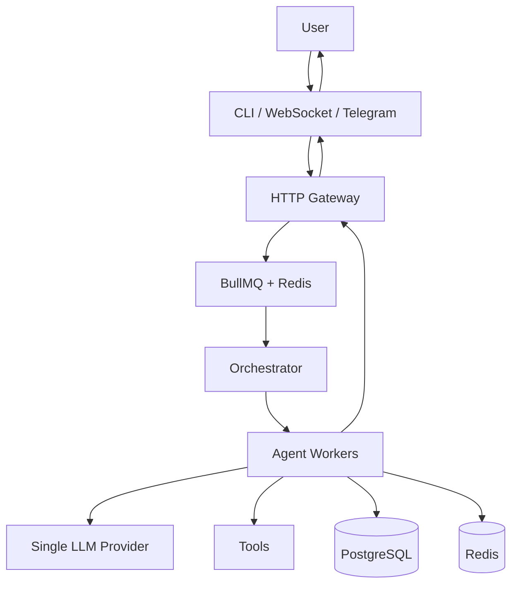
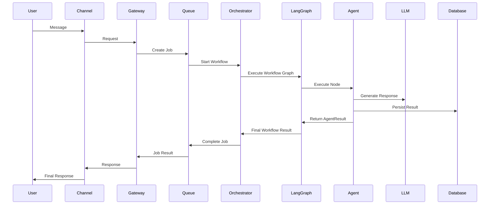

# Autonomous AI-First Delivery Blueprint (Docker-First)

## 1) Purpose and Decision Baseline

This documentation defines a **spec-anchored** development model (specification is the source of truth; implementation must conform).  
The system is engineered to be implemented primarily by AI agents in Cursor, with strict quality gates and deterministic integration contracts.

### Non-negotiable architecture decisions

- Runtime: `TypeScript` on `Node.js 22 LTS`.
- Deployment model: **containers only** via `Docker` + `docker-compose`.
- LLM provider model: Ollama Local First.
- Orchestration model: centralized orchestrator + specialized workers + contract-driven handoff.
- Database: `PostgreSQL 16`.
- Queue + cache: `Redis 7` + `BullMQ`.
- Observability baseline: structured logs + traces + metrics from first production deployment.
- Quality gate authority: CI pipeline is final authority, not prompt text.

### Why this model

- Spec-Driven Development reduces ambiguity and AI drift.
- Contract-first module boundaries enable parallel multi-agent delivery.
- Milestone slicing allows deterministic incremental progression and safer rollback.
- CI-enforced constraints prevent quality and security regressions common in AI-generated code.

---

## 2) Directory Structure (Target State)

```text
/
├── DOCUMENTATION.md
├── docker-compose.yml
├── .env.example
├── .editorconfig
├── .gitignore
├── .nvmrc
├── package.json
├── pnpm-workspace.yaml
├── AGENTS.md
├── docs/
│   ├── templates/
│   │   ├── stage-readme-template.md
│   │   ├── module-contract-template.md
│   │   ├── agent-handoff-template.md
│   │   └── ambiguity-record-template.md
│   └── stages/
│       ├── 01-foundation/README.md
│       ├── 02-infrastructure/README.md
│       ├── 03-core-domain/README.md
│       ├── 04-apis/README.md
│       ├── 05-integrations/README.md
│       ├── 06-frontend/README.md
│       ├── 07-observability/README.md
│       ├── 08-security/README.md
│       ├── 09-scalability/README.md
│       └── 10-final-hardening/README.md
├── apps/
│   ├── gateway/
│   ├── orchestrator/
│   ├── worker/
│   └── web/
├── packages/
│   ├── contracts/
│   ├── domain/
│   ├── tools/
│   ├── shared/
│   └── test-kits/
├── tests/
│   ├── integration/
│   ├── contract/
│   ├── e2e/
│   ├── smoke/
│   └── regression/
└── .github/workflows/
    ├── ci.yml
    ├── nightly-quality.yml
    └── release.yml
```

---

## 3) Milestone Roadmap (Incremental and Parallel)

| Milestone | Stage           | Goal                                | Parallel Tracks                             |
| --------- | --------------- | ----------------------------------- | ------------------------------------------- |
| M1        | Foundation      | standards, contracts, base skeleton | docs + tooling + contracts                  |
| M2        | Infrastructure  | compose stack and runtime bootstrap | gateway infra + worker infra + db infra     |
| M3        | Core Domain     | deterministic domain model          | aggregates + use cases + repositories       |
| M4        | APIs            | stable external/internal APIs       | REST + async events + validation            |
| M5        | Integrations    | external provider adapters          | LLM adapters + web tools + storage adapters |
| M6        | Frontend        | user-facing workflow                | web shell + session view + task tracking    |
| M7        | Observability   | production visibility               | metrics + traces + dashboards + alerts      |
| M8        | Security        | policy hardening                    | authN/authZ + secrets + SAST/DAST           |
| M9        | Scalability     | throughput and resilience           | load/perf + queue tuning + cache strategy   |
| M10       | Final Hardening | release readiness                   | regression + chaos + DR drills              |

---

## 4) Multi-Agent Execution Architecture

### Agent roles

- **Coordinator Agent**: reads stage README, decomposes tasks, assigns ownership.
- **Implementer Agent(s)**: execute scoped tasks inside stage boundaries.
- **Verifier Agent**: validates against acceptance criteria and quality gates.
- **Integrator Agent**: merges compliant outputs, resolves contract mismatches.

### Context consumption protocol

1. Read `AGENTS.md`.
2. Read target stage `docs/stages/<stage>/README.md`.
3. Read module contracts under `packages/contracts`.
4. Read only relevant code subtree; do not load entire repo by default.
5. Confirm task objective in `agent-handoff-template.md` format.

### Ambiguity handling protocol

- If requirement lacks measurable criterion, open `ambiguity record`.
- Propose exactly 2 implementation options with trade-offs.
- Mark status `BLOCKED` until ambiguity is resolved or fallback rule applies.
- Fallback rule: choose stricter/security-first interpretation and log decision.

### Failure handling protocol

- Retry transient failures (max 2) with exponential backoff.
- On persistent failure: create failure report with reproduction and suspected root cause.
- Trigger handoff to debugger/verifier agent with minimal reproducible context.

### Handoff protocol

- Every handoff must include:
  - input commit SHA
  - stage id
  - changed files
  - contract references
  - test evidence
  - unresolved risks

---

## 5) Contract-First Parallelization Strategy

### Decoupled module map

- `apps/gateway` owns transport and request validation only.
- `apps/orchestrator` owns workflow graph and routing decisions.
- `apps/worker` owns specialized execution and tool invocation.
- `packages/domain` owns pure business logic (framework-independent).
- `packages/contracts` owns API schemas, event schemas, DTO versions.
- `packages/tools` owns tool adapters with allowlists and sandbox wrappers.

### Conflict avoidance rules

- One module = one primary owner agent per sprint.
- Cross-module changes require contract PR first.
- Any breaking change requires version bump (`vN`) and deprecation note.
- No agent may change another agent-owned module without explicit handoff.

### Integration contracts

- REST contract: OpenAPI with backward compatibility checks.
- Async contract: JSON Schema with strict additionalProperties false.
- Domain contract: exported TypeScript interfaces + invariant tests.

---

## 6) Quality Gate Policy (Mandatory)

### Static Quality

- ESLint: `0` errors, max `10` warnings per PR (target: `0`).
- Prettier: all files formatted; CI fails on diff.
- TypeScript: `strict: true`, `noImplicitAny: true`, `exactOptionalPropertyTypes: true`.
- Cyclomatic complexity: max `10` per function (`12` temporary max with exception ticket).
- Cognitive complexity: max `15` per function.
- Duplication (Sonar): max `3%` on new code, max `5%` overall.
- Code smells:
  - Critical: `0`
  - Major: max `3` on new code
- Security hotspots reviewed: `100%`.
- Vulnerability policy: `0` critical, `0` high.
- Sonar rating required: Reliability `A`, Security `A`, Maintainability `A`.

### Test Quality

- Line coverage: min `85%` overall, `90%` for `packages/domain`.
- Branch coverage: min `80%` overall.
- Mutation score (critical modules): min `75%` now, target `80%` by M10.
- Contract tests: `100%` pass for published API/event contracts.
- E2E smoke: mandatory on default branch and release branches.

### Commit and PR validation

- Conventional Commits required.
- Signed commits preferred; mandatory for release branches.
- PR must reference stage id and acceptance criteria checklist.
- At least 1 reviewer human approval for protected branches.
- AI review is advisory; CI gates are mandatory.

---

## 7) CI/CD Strategy (Docker + Compose)

### Pipeline stages (`.github/workflows/ci.yml`)

1. `validate`: schema checks, lint, formatting, type-check.
2. `unit`: run unit tests in containers.
3. `integration`: start compose dependencies, run integration suites.
4. `contract`: OpenAPI + JSON Schema compatibility checks.
5. `security`: SAST, secrets scan, dependency audit, container scan.
6. `quality`: Sonar analysis and gate enforcement.
7. `build`: build immutable Docker images with SHA tags.
8. `smoke`: run smoke tests against built stack.

### Release workflow (`release.yml`)

- Trigger: semver tag.
- Build and push signed images.
- Deploy to staging.
- Run staged smoke + critical path E2E.
- Manual approval.
- Production deploy with automatic rollback guard.

### Nightly workflow (`nightly-quality.yml`)

- Full mutation testing.
- Extended regression.
- Performance baseline comparison.
- Drift detection between contracts and implementation.

---

## 8) Context Engineering Governance

### Context split strategy

- Global context: `AGENTS.md`, architecture decisions, coding conventions.
- Stage context: each stage README.
- Task context: handoff file + changed module contracts + minimal code slices.

### Context overflow prevention

- Max 1 stage + 2 adjacent contracts loaded per implementation session.
- Prefer summaries over raw logs after 300 lines.
- Persist compressed state snapshots in stage progress log.

### Persistent memory strategy

- Keep durable decisions in markdown ADR files under `docs/adr/`.
- Keep ephemeral notes in task handoff files; rotate weekly.
- Every resolved ambiguity must produce a decision record.

### Specification versioning

- Version each stage README with semantic docs version: `vMAJOR.MINOR.PATCH`.
- Breaking requirement changes increment MAJOR.
- Contract and stage version bumps must be linked in same PR.

### Context recovery

- Recovery starts from:
  1. latest green commit
  2. stage README
  3. unresolved ambiguity records
  4. failing pipeline artifact links

---

## 9) Git and Collaboration Strategy

### Branching

- `main`: releasable only.
- `develop`: integration branch.
- `stage/<id>-<short-name>`: stage-level integration.
- `feature/<stage-id>/<scope>`: implementation tasks.
- `hotfix/<issue-id>`: production urgent fixes.

### Commit strategy

- Format: `type(scope): message`.
- Scope must include stage or module (`stage-04`, `contracts`, `orchestrator`).
- Every commit references acceptance criterion ID when applicable.

### PR strategy

- PR template must include:
  - objective
  - linked stage
  - contracts touched
  - test evidence
  - risk/rollback notes
- Max PR size target: `<= 500` changed lines excluding snapshots/generated files.

### Automated review strategy

- Required checks:
  - lint/type/test
  - contract compatibility
  - Sonar gate
  - security scans
  - docker image scan

---

## 10) Observability, Logging, Monitoring, Security

### Observability

- Metrics: request latency, queue depth, success/failure rate, token usage, cost/request.
- Traces: end-to-end request and agent workflow spans.
- Logs: JSON structured with `requestId`, `workflowId`, `agentId`, `stageId`.

### Monitoring

- SLO examples:
  - API availability: `99.9%`
  - P95 API latency: `< 400ms` for non-LLM endpoints
  - Workflow completion success: `>= 98%`
- Alert severity:
  - P1: security breach, data corruption, full outage
  - P2: degraded critical path, queue saturation
  - P3: non-critical regression

### Security baseline

- Mandatory secret manager usage, never plaintext secrets in repo.
- Tool execution allowlist per agent role.
- Input validation for all external payloads.
- Dependency and container vulnerability scans at every PR.
- SBOM generation at build stage.

---

## 11) Rollback and Recovery Strategy

### Rollback triggers

- Failed smoke tests post-deploy.
- Error budget burn > threshold in first 15 minutes.
- Critical security finding after release.

### Rollback mechanism

- Blue/green or rolling deployment with previous image SHA retained.
- One-command rollback via deployment workflow input `rollback_to_sha`.
- Database rollback via forward-only migration policy + compensating migration scripts.

### Disaster recovery

- Daily backup validation restore drill.
- RPO target: `15 min`.
- RTO target: `60 min`.

---

## 12) Final Global Quality Checklist

- [ ] Stage acceptance criteria all marked PASS.
- [ ] No unresolved ambiguity record in `open` state.
- [ ] All required CI checks green.
- [ ] Sonar gate passed with ratings A/A/A.
- [ ] Coverage and mutation thresholds met.
- [ ] Contract tests and compatibility checks passed.
- [ ] Security scans show no critical/high findings.
- [ ] Smoke and critical E2E tests passed in staging.
- [ ] Rollback tested with previous release artifact.
- [ ] Documentation updated for changed behavior and interfaces.

---

## 13) Stage Readmes

Each stage has a dedicated README in:

- `docs/stages/01-foundation/README.md`
- `docs/stages/02-infrastructure/README.md`
- `docs/stages/03-core-domain/README.md`
- `docs/stages/04-apis/README.md`
- `docs/stages/05-integrations/README.md`
- `docs/stages/06-frontend/README.md`
- `docs/stages/07-observability/README.md`
- `docs/stages/08-security/README.md`
- `docs/stages/09-scalability/README.md`
- `docs/stages/10-final-hardening/README.md`

These files are intentionally prescriptive and optimized for autonomous AI-agent execution.

# Lean Multi-Agent Architecture Blueprint

## Overview

This document defines a lean and pragmatic architecture for a distributed multi-agent platform focused on:

- Fast delivery
- Low operational complexity
- Incremental evolution
- Clear separation of responsibilities
- Future extensibility without premature overengineering

The system is designed to start simple while preserving the ability to evolve into a more distributed architecture when real scaling requirements emerge.

---

# Core Principles

## 1. YAGNI First

Only build what is required today.

Avoid introducing infrastructure, abstractions, or distributed systems complexity before a validated need exists.

---

## 2. Evolutionary Architecture

The architecture must evolve based on:

- Real usage
- Measured bottlenecks
- Operational pain
- Product requirements

Not assumptions.

---

## 3. Stateless Agents

Agents should remain stateless.

Persistent state belongs to external storage systems.

Benefits:

- Easier scaling
- Simpler recovery
- Better fault tolerance
- Cleaner execution model

---

## 4. Channels Are Transport Only

Channels must:

- Receive messages
- Normalize payloads
- Return responses

Channels must not:

- Execute AI logic
- Manage workflows
- Store orchestration state

---

# Phase 1 Architecture (MVP)

## Goals

Build a working multi-agent system capable of:

- Receiving messages
- Routing tasks
- Executing specialized agents
- Calling tools
- Returning responses

Without unnecessary distributed infrastructure.

---

# High-Level Architecture



---

# LangGraph Integration

## Purpose

LangGraph will be used as the workflow and agent execution orchestration layer.

Its role is to provide:

- Stateful workflow execution
- Agent coordination
- Execution graphs
- Sequential and future parallel workflows
- Retry-friendly execution flows
- Explicit reasoning paths

## Why LangGraph

LangGraph provides a strong balance between:

- Flexibility
- Control
- Multi-agent workflow orchestration
- Maintainable execution graphs

Without requiring the operational complexity of heavier distributed workflow platforms during Phase 1.

## Recommended Usage

Use LangGraph as:

- Internal orchestration runtime
- Workflow state manager
- Agent execution graph engine

Do not delegate the entire system architecture to LangGraph.

The platform architecture should still own:

- Gateway
- Queueing
- Persistence
- Security
- Tool execution
- Infrastructure
- Governance

## Recommended Design

```text
Gateway
   ↓
BullMQ Job
   ↓
LangGraph Workflow
   ↓
Agent Nodes
   ↓
Tools / LLM / Memory
```

## Important Guideline

Keep LangGraph isolated behind an internal orchestration abstraction.

Avoid coupling the entire application directly to LangGraph-specific APIs.

This preserves the ability to evolve or replace the orchestration engine in the future if necessary.

---

# Recommended Initial Stack

| Layer          | Technology                        |
| -------------- | --------------------------------- |
| Language       | TypeScript                        |
| Framework      | Fastify                           |
| Queue          | BullMQ                            |
| Cache          | Redis                             |
| Database       | PostgreSQL                        |
| Vector Search  | pgvector (only if needed)         |
| LLM Provider   | Ollama first, OpenAI or Anthropic |
| Infrastructure | Docker Compose                    |
| Logging        | Pino                              |

---

# System Components

# 1. Channel Layer

## Responsibilities

- Receive messages
- Handle authentication
- Normalize requests
- Stream responses back to users

## Examples

- CLI
- Telegram Bot
- WebSocket Gateway
- Web Application

## Important Rule

No AI or orchestration logic belongs here.

---

# 2. Gateway Layer

## Responsibilities

- Receive normalized requests
- Validate payloads
- Create request IDs
- Push jobs into the queue
- Return responses

## Design Goal

Keep the gateway lightweight.

It should coordinate requests, not execute business logic.

---

# 3. Queue Layer

## Responsibilities

- Background execution
- Task scheduling
- Retry handling
- Concurrency control

## Recommended Technology

BullMQ + Redis.

This is sufficient for MVP-scale systems and significantly simpler than Kafka or NATS.

---

## Ambiguity Handling

Rules-based routing must include a fallback strategy.

If no rule matches:

- Route to a generic assistant agent
  OR
- Return a structured unsupported-task response

Example:

```typescript
const fallbackAgent = 'general-assistant-agent'
```

Avoid silent routing failures.

---

## Multi-Step Coordination Example

Sequential workflows should be explicitly modeled.

Example:

```text
User Request
   ↓
Research Agent
   ↓
Summary Agent
   ↓
Response
```

In LangGraph:

- Each Agent becomes a node
- AgentResult becomes the next node input
- The workflow state is persisted internally by LangGraph

The Orchestrator owns:

- Workflow creation
- Node sequencing
- Failure handling
- Final response aggregation

---

# 4. Orchestrator

## Responsibilities

The Orchestrator is responsible for:

- Determining which agent should execute a task
- Managing execution flow
- Handling failures
- Coordinating sequential workflows

## Phase 1 Recommendation

Use rules-based routing.

Example:

```typescript
const routing = {
  code_generation: 'coding-agent',
  documentation: 'docs-agent',
  summarization: 'summary-agent',
}
```

Avoid LLM-based orchestration initially.

---

# 5. Agent Workers

## Responsibilities

Agents are specialized workers responsible for:

- Executing tasks
- Calling tools
- Interacting with the LLM
- Producing outputs

## Phase 1 Recommendation

Start with a fixed set of agents:

- Coding Agent
- Research Agent
- Summary Agent

Avoid dynamic spawning initially.

---

# Agent Communication Model

## AgentInput Definition

AgentInput defines the execution context passed from the Orchestrator into an Agent.

```typescript
interface AgentInput {
  workflowId: string
  taskId: string

  userMessage: string

  conversationHistory: Message[]

  context: {
    summaries?: string[]
    retrievedDocuments?: RetrievedDocument[]
    previousAgentResults?: AgentResult[]
  }

  metadata: {
    userId?: string
    channel?: string
    requestId: string
  }
}
```

## AgentResult Definition

AgentResult defines the standardized output returned by an Agent.

```typescript
interface AgentResult {
  success: boolean

  output: string

  structuredOutput?: unknown

  toolResults?: ToolExecutionResult[]

  usage?: {
    inputTokens: number
    outputTokens: number
    estimatedCostUsd: number
  }

  nextActions?: {
    type: 'continue' | 'complete' | 'handoff'
    targetAgent?: string
  }

  error?: {
    message: string
    retryable: boolean
  }
}
```

These contracts must remain stable and versioned because they are the primary communication layer between the Orchestrator and Agent Workers.

---

# Agent Interface

```typescript
interface Agent {
  id: string
  role: string

  allowedTools: ToolName[]

  execute(input: AgentInput): Promise<AgentResult>
}
```

---

# 6. Tool Execution

## Recommendation

Do not introduce MCP initially.

Use direct tool execution.

Example:

```typescript
interface Tool {
  name: string

  execute(input: unknown): Promise<unknown>
}
```

## Example Tools

- File Reader
- Git Operations
- Web Search
- Shell Execution

---

# 7. Memory Strategy

## PostgreSQL

Use PostgreSQL for:

- Conversations
- Session history
- Workflow records
- Agent execution logs

---

## Redis

Use Redis for:

- Temporary context
- Queue state
- Active workflow cache

---

## pgvector (Optional)

Only introduce semantic memory when:

- Similarity search becomes necessary
- Context retrieval becomes a bottleneck

Do not introduce a dedicated vector database initially.

---

# Security Requirements

## Tool Allowlist

Every agent must have explicit tool permissions.

Example:

```typescript
allowedTools: ['read_file', 'web_search']
```

Never allow unrestricted tool access.

---

## Input Validation

Validate all tool inputs before execution.

Never pass raw user input directly into shell commands or filesystem operations.

---

## Execution Isolation

Any tool capable of:

- Shell execution
- File writing
- System access

Must run in an isolated process or sandbox.

---

# LLM Reliability and Cost Management

## Timeouts

All LLM calls must have explicit timeouts.

Example:

```typescript
const timeoutMs = 30000
```

Workers must never wait indefinitely for provider responses.

---

## Retry Policy

Transient failures should use bounded retries with exponential backoff.

Example:

- maxRetries: 2
- exponentialBackoff: true

---

## Circuit Breaker

The system should temporarily disable a provider after repeated failures.

This prevents cascading worker starvation when providers are degraded.

---

## Cost Tracking

Every AgentResult should persist:

- input tokens
- output tokens
- estimated USD cost
- provider used
- model used

This enables:

- workflow cost visibility
- budgeting
- optimization analysis
- operational monitoring

---

# BullMQ and LangGraph Responsibilities

To avoid overlapping concerns:

| Component | Responsibility                              |
| --------- | ------------------------------------------- |
| BullMQ    | Transport, scheduling, retries, concurrency |
| LangGraph | Internal workflow state and node execution  |

## Recommended Flow

```text
Gateway
   ↓
BullMQ Job
   ↓
LangGraph Workflow Execution
   ↓
Agent Nodes
   ↓
Workflow Result
   ↓
BullMQ Completion
```

BullMQ should not manage internal workflow state.

LangGraph should not become the transport layer.

---

# Response Flow

Agent Workers must never communicate directly with the HTTP Gateway.

Responses should return through the workflow execution layer.

Recommended flow:

```text
Agent Worker
   ↓
LangGraph State
   ↓
BullMQ Job Result
   ↓
Gateway
   ↓
Channel
   ↓
User
```

This preserves separation of responsibilities and prevents coupling between workers and transport layers.

---

# Logging and Observability

## Initial Recommendation

Use structured logs only.

Example stack:

- Pino
- Request IDs
- Workflow IDs
- Agent execution logs

Avoid introducing distributed tracing initially.

---

# Suggested Monorepo Structure

```text
/apps
  /gateway
  /worker
  /telegram-bot

/packages
  /agents
  /tools
  /shared
  /database
```

---

# Evolution Path

## Introduce only when necessary

| Problem                                 | Solution                       |
| --------------------------------------- | ------------------------------ |
| Need multiple channels                  | Introduce event-driven gateway |
| Need semantic retrieval                 | Add pgvector                   |
| Need multiple LLM providers             | Add LLM router                 |
| Tool system becomes repetitive          | Introduce MCP abstraction      |
| Workflows become complex                | Evaluate Temporal              |
| High-scale distributed messaging needed | Evaluate NATS                  |

---

# End-to-End Execution Flow



---

# Streaming Strategy

## MVP Recommendation

For Phase 1, responses should be returned only after workflow completion.

This keeps the execution model significantly simpler and avoids introducing streaming infrastructure prematurely.

---

## Future Streaming Architecture

If token-by-token streaming becomes necessary for WebSocket or realtime channels, introduce a secondary event channel.

Recommended approach:

```text
Agent Execution
   ↓
Redis Pub/Sub (workflowId channel)
   ↓
Gateway Subscriber
   ↓
WebSocket Stream
   ↓
Client
```

## Responsibility Split

| Component     | Responsibility            |
| ------------- | ------------------------- |
| BullMQ        | Durable job execution     |
| Redis Pub/Sub | Realtime streaming events |
| Gateway       | WebSocket fanout          |

This preserves:

- Workflow durability
- Realtime streaming
- Loose coupling
- Simpler operational boundaries

Streaming should only be introduced once realtime UX becomes a validated product requirement.

---

# Final Recommendation

The initial architecture should prioritize:

- Simplicity
- Fast iteration
- Clear ownership
- Operational stability
- Low infrastructure complexity

The goal of Phase 1 is not to build the final distributed AI platform.

The goal is to validate:

- Agent orchestration
- Workflow quality
- Tool execution patterns
- User experience
- System reliability

Once those are validated, the architecture can evolve incrementally into a more distributed and scalable platform.
